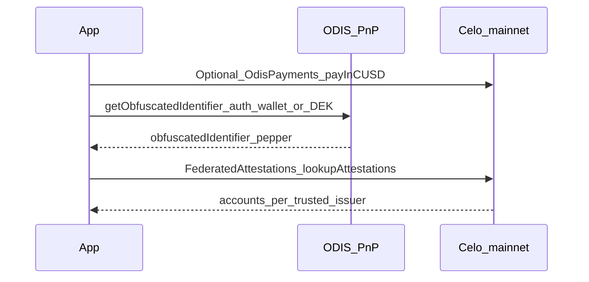

# ODIS, SocialConnect, and FederatedAttestations

> Practical reference for **phone number → on-chain address** resolution on Celo using **ODIS (PnP)** and **FederatedAttestations**. Aligned with `@celo/identity` + `@celo/contractkit` behavior on mainnet.

---

## Concepts

- **Plaintext identifier**: E.164 phone string (e.g. `+14155552671`). Invalid formats are rejected by `@celo/identity`.
- **ODIS (Phone Number Privacy / PnP)**: Off-chain service that returns a **blind signature**; the client derives a **pepper** and **obfuscated identifier** (bytes32-style hex). Same phone → same obfuscated id for a given ODIS key set (interoperability).
- **FederatedAttestations** (on-chain): Registry of **identifier → account** mappings, **scoped by issuer**. You choose which **trusted issuers** to query.
- **SocialConnect**: Name for the overall **issuer + ODIS + FederatedAttestations** pattern. Original GitHub org repos are **unmaintained**; use the **`@celo/identity`** npm package (source lives under the Social Connect / celo SDK tree). Do not treat old README snippets as authoritative without verifying against the installed SDK.

---

## End-to-end flow



1. (Often required on mainnet) Ensure **PnP quota** &gt; 0 — see **Quota** below.
2. Call **`OdisUtils.Identifier.getObfuscatedIdentifier`** with **PnP** `ServiceContext`.
3. Call **`FederatedAttestations.lookupAttestations(obfuscatedIdentifier, trustedIssuers)`**.

---

## Contracts (mainnet)

Verified core addresses are in **`contracts.md`**:

| Role | Contract | Notes |
|------|----------|--------|
| Attestation registry | **FederatedAttestations** `0x0aD5b1d0C25ecF6266Dd951403723B2687d6aff2` | Use `kit.contracts.getFederatedAttestations()` with ContractKit |
| Quota payment | **OdisPayments** `0xAE6B29f31B96e61DdDc792f45fDa4e4F0356D0CB` | Pulls **USDm / cUSD** (StableToken) to credit PnP quota |
| USDm / cUSD token | `0x765DE816845861e75A25fCA122bb6898B8B1282a` | 18 decimals — see `minipay-guide.md` |

### MiniPay issuer (trusted issuer for lookups)

When resolving numbers attested for **MiniPay**, include this issuer in `trustedIssuers`:

`0x7888612486844Bb9BE598668081c59A9f7367FBc`

This is **not** a “core protocol” address like Registry; it is the **attestation issuer** you trust for MiniPay-scoped mappings. Other wallets (Kaala, Libera, etc.) use **different** issuer addresses.

---

## Service context (PnP vs DOMAIN)

Use the **PnP** API for phone obfuscation:

```typescript
const serviceContext = OdisUtils.Query.getServiceContext(
  OdisUtils.Query.OdisContextName.MAINNET,
  OdisUtils.Query.OdisAPI.PNP,
);
```

For **Alfajores**, use `OdisContextName.ALFAJORES` instead.

**Important:** The **combiner URL and public key** bundled in your installed `@celo/identity` may **differ** from older blog/docs tables (e.g. legacy `cloudfunctions.net` URLs). Trust the SDK’s `getServiceContext` for the version you ship.

---

## Authentication (`AuthSigner`)

| Method | When to use |
|--------|-------------|
| **`WALLET_KEY`** | Pass a **ContractKit** instance with the signing account added and **`defaultAccount`** set. Needed for many server-side scripts. |
| **`ENCRYPTION_KEY` (DEK)** | Pass **`rawKey`** (DEK private key). **Preferred** in production when the user’s DEK is **registered on-chain** (`Accounts.setAccountDataEncryptionKey`). ODIS can reuse blinding/quota behavior tied to the DEK. |

Type import:

```typescript
import type { AuthSigner } from "@celo/identity/lib/odis/query";
```

Example **`WALLET_KEY`** signer:

```typescript
const authSigner: AuthSigner = {
  authenticationMethod: OdisUtils.Query.AuthenticationMethod.WALLET_KEY,
  contractKit: kit,
};
```

---

## Quota (mainnet gotcha)

- **`getPnpQuotaStatus(account, authSigner, serviceContext)`** returns `remainingQuota`, `totalQuota`, `performedQueryCount`.
- **Having USDm/cUSD in the wallet does not automatically grant PnP quota.** If `remainingQuota` is **0**, you typically must pay into **`OdisPayments`**:
  1. **`StableToken.increaseAllowance(odisPaymentsAddress, amountWei)`**
  2. **`OdisPayments.payInCUSD(quotaAccount, amountWei)`** — credits **that account’s** PnP quota.

SocialConnect-era examples often use a small amount (e.g. **0.01** token in wei: `10000000000000000` at 18 decimals) to top up.

Celo docs also describe quota in terms of **account activity** in some cases; if quota stays **0** after funding, run **`payInCUSD`** for the **same address** that appears as **`account`** in `getObfuscatedIdentifier` (the **quota account**).

---

## Quota account vs trusted issuer

- **`account` (third argument to `getObfuscatedIdentifier`)**: Address **billed for ODIS quota** — usually the **querying wallet** (must match signer context for `WALLET_KEY`).
- **`trustedIssuers` in `lookupAttestations`**: Which **issuers’ attestations** you trust (e.g. **MiniPay issuer** above). **Not** the same as the quota account.

---

## Code pattern (ContractKit + ODIS + FederatedAttestations)

**Server or backend** with a private key (never expose keys in a browser):

```typescript
import { newKit } from "@celo/contractkit";
import { OdisUtils } from "@celo/identity";
import type { AuthSigner } from "@celo/identity/lib/odis/query";

const MINIPAY_ISSUER = "0x7888612486844Bb9BE598668081c59A9f7367FBc";

async function lookupMiniPayAddress(
  rpcUrl: string,
  walletPrivateKey: string,
  phoneE164: string,
) {
  const kit = newKit(rpcUrl);
  const pk = walletPrivateKey.startsWith("0x")
    ? walletPrivateKey
    : `0x${walletPrivateKey}`;
  kit.addAccount(pk);
  const locals = kit.connection.getLocalAccounts();
  if (!locals.length) throw new Error("No local account");
  kit.defaultAccount = locals[0];
  const quotaAccount = locals[0];

  const serviceContext = OdisUtils.Query.getServiceContext(
    OdisUtils.Query.OdisContextName.MAINNET,
    OdisUtils.Query.OdisAPI.PNP,
  );

  const authSigner: AuthSigner = {
    authenticationMethod: OdisUtils.Query.AuthenticationMethod.WALLET_KEY,
    contractKit: kit,
  };

  const { obfuscatedIdentifier } =
    await OdisUtils.Identifier.getObfuscatedIdentifier(
      phoneE164,
      OdisUtils.Identifier.IdentifierPrefix.PHONE_NUMBER,
      quotaAccount,
      authSigner,
      serviceContext,
    );

  const federated = await kit.contracts.getFederatedAttestations();
  const { accounts } = await federated.lookupAttestations(obfuscatedIdentifier, [
    MINIPAY_ISSUER,
  ]);

  return accounts[0] ?? null;
}
```

### Viem-only alternative

You may call **FederatedAttestations** with **viem** `readContract` and **`FederatedAttestationsAbi`** from `@celo/abis`, but you must still run **`getObfuscatedIdentifier`** via **`@celo/identity`** first. Decode **`lookupAttestations`** return values to match the ABI (tuple with arrays).

---

## Operational notes

- **E.164**: Use `+[country][number]`; leading `+` and valid length per `@celo/base` phone helpers inside the SDK.
- **SDK warnings**: ODIS responses may include **warnings** (e.g. signer disagreement) while still succeeding; log them in diagnostics.
- **Deterministic blinding**: The SDK may warn to use a **deterministic seed** (e.g. **DEK**) so replays do not burn extra quota — relevant for production clients.

---

## Documentation links

- [Query On-Chain Identifiers with ODIS (ContractKit)](https://docs.celo.org/tooling/libraries-sdks/contractkit/odis)
- [Data encryption key (DEK)](https://docs.celo.org/developer/contractkit/data-encryption-key) (Celo docs)
- Legacy context: [ODIS use case: phone number privacy](https://docs.celo.org/legacy/protocol/identity/odis-use-case-phone-number-privacy)

---

## Packages

```bash
npm install @celo/contractkit @celo/identity
```

`@celo/identity` depends on ContractKit-compatible tooling for **`WALLET_KEY`** signing.
